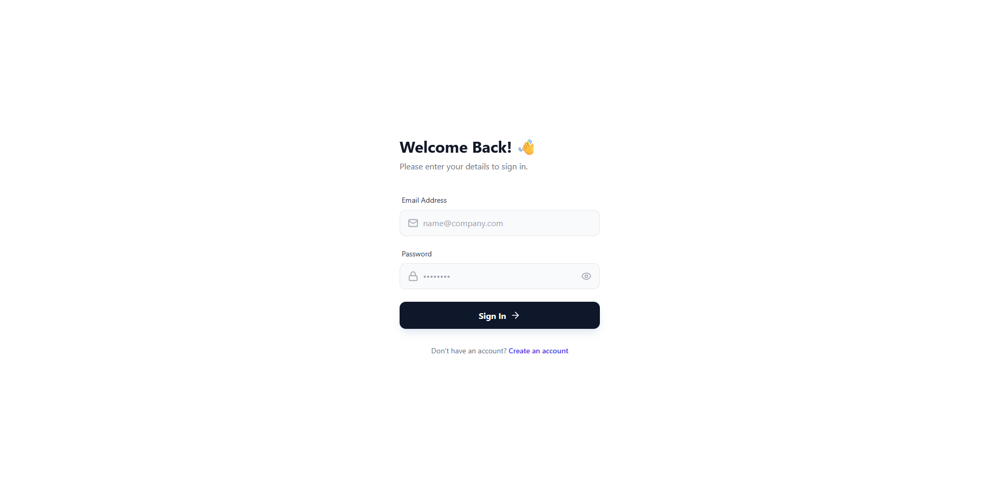
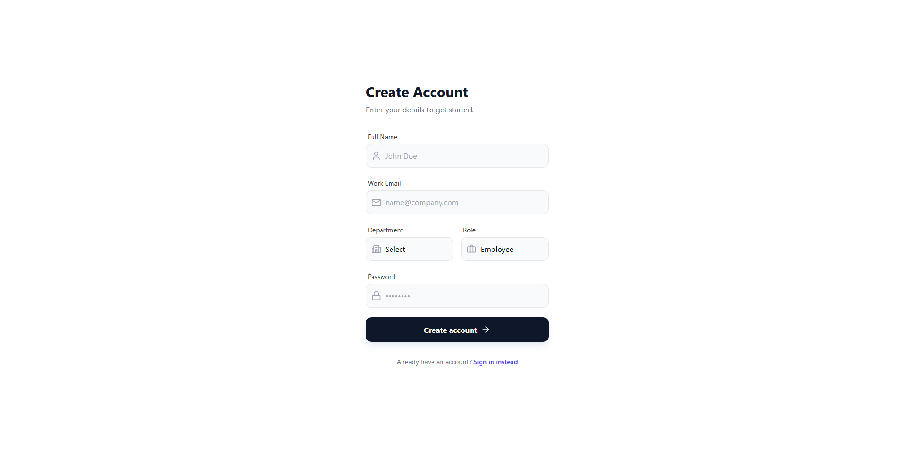
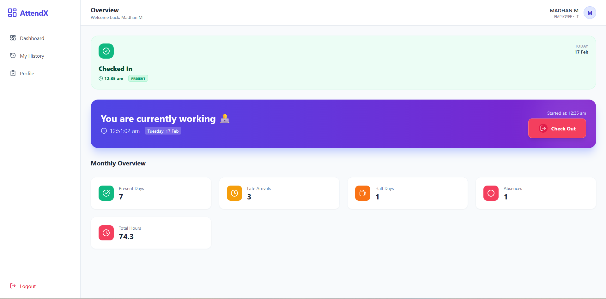
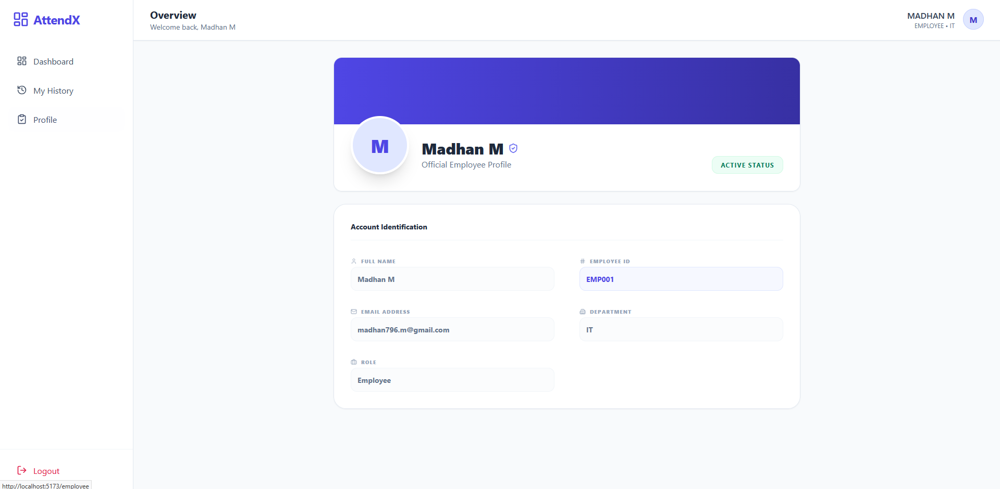
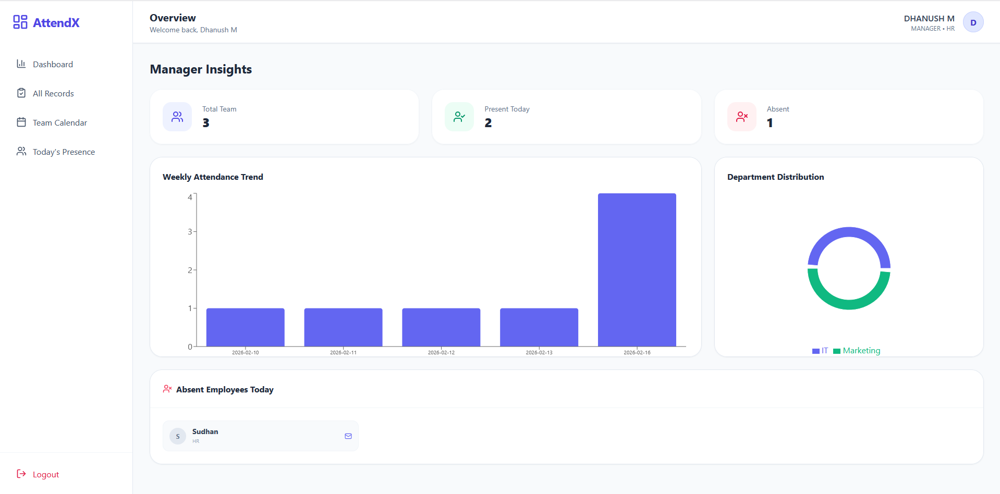
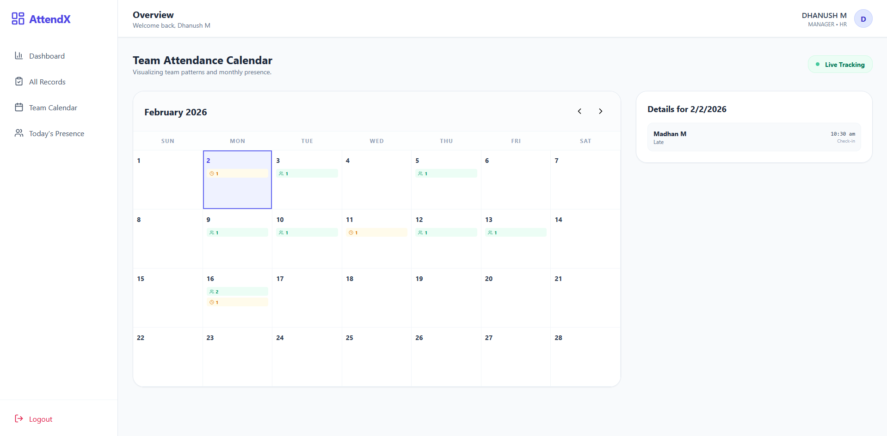
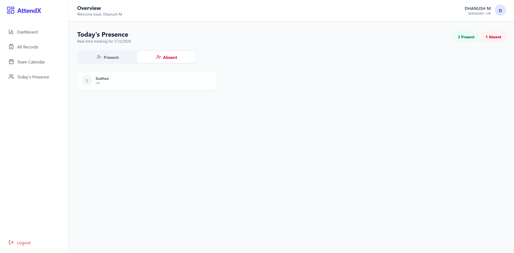
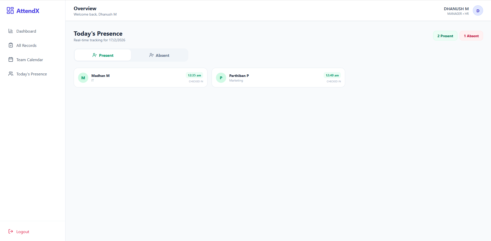
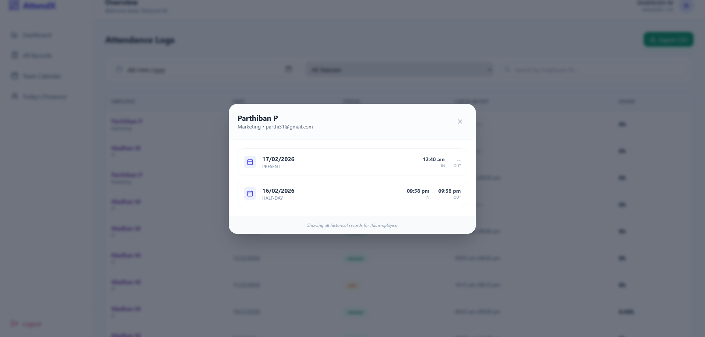

# 🕒 Employee Attendance Management System

A production-ready full-stack **MERN** application built for real-time attendance tracking, featuring automated status detection, managerial analytics, and visual reporting.

---

## 👤 Developer Information

- **Name:** Madhan M  
- **College:** Veltech Ranga Sanku Arts College
- **Contact Number:** +91 9384727902
- **Email:** madhan796.m@gmail.com / 6277@velsrscollege.com  
- **Video Presentation:** (https://drive.google.com/file/d/1mnHjz5JOrR_9QzFOi8cERu3ME5OeO9_i/view?usp=sharing)

---

## 🚀 Key Features

### 👨‍💼 Managerial Perspective (Admin Control)

- **Insights Dashboard**
  - Weekly Attendance Trends (Bar Chart)
  - Department Distribution (Pie Chart)

- **Live Presence Tracking**
  - Real-time view of **Present vs Absent** employees

- **Team Calendar**
  - Monthly attendance grid for pattern recognition

- **Advanced Records Management**
  - Filter by:
    - Employee ID (`EMP001`)
    - Name
    - Date
    - Status

- **Backend CSV Export**
  - Securely generate and download filtered reports

- **Employee Drill-down**
  - Detailed historical attendance logs via modal view

---

### 👨‍💻 Employee Perspective

- **Real-time Clocking**
  - Check-in / Check-out
  - Automatic **Late detection** (after 10:00 AM)

- **Today's Status Widget**
  - Instant display of attendance state

- **Personal Attendance History**
  - Searchable personal records table

- **Official Profile**
  - Department
  - Role
  - Employee ID

---

## 🛠 Tech Stack

| Layer | Technology |
|-------|------------|
| **Frontend** | React.js (Vite), Tailwind CSS, Lucide Icons |
| **State Management** | Zustand |
| **Charts / Visualization** | Recharts |
| **Backend** | Node.js, Express.js |
| **Database** | MongoDB with Mongoose (ODM) |
| **Authentication** | JWT & BcryptJS |

---

### 2. Backend Configuration

**Navigate to the server directory:**
```bash
cd emp-attendance-backend
npm install
npm run dev

Ctrl + C to stop the server

# Creating seeds

# make sure you're inside the emp-attendance-backend directory

node scripts/seed.js

# again run the server
npm run dev

```

### **3\. Frontend Configuration**

```
cd emp-attendance-frontend    
npm install
npm run dev
``` 

📁 Project Structure
--------------------
├── emp-attendance-frontend/                # React Frontend  
    │    
    ├── src/  │   
    │   ├── api/           # Axios service layers  │   
    │   ├── components/    # Reusable UI (Modals, Charts, Stats) │   
    │   ├── pages/         # Feature-specific pages (Dashboard, Calendar)  │   
    │   └── store/         # Zustand Auth store  

├── emp-attendance-backend/   # Node.js Backend  
│   ├── controllers/       # Business logic (Auth, Attendance)  
│   ├── models/            # Mongoose Schemas (User, Attendance)  
│   ├── routes/            # Express Endpoints  
│   └── utils/             # Date processing & CSV generation   `

Refer env.example in /emp-attendance-frontend/ for Environment variables

🧪 Credentials for Testing
--------------------------

### **Manager Account**

*   **Email:** admin@company.com (or your seeded admin email)
    
*   **Password:** admin123
    

### **Employee Account**

*   **Email:** user@company.com
    
*   **Password:** user123
    
*   **Employee ID:** EMP001 (Use this in the Manager filter to test ID searching)
    

🛡 Security & Design Standards
------------------------------

*   **Stateless Auth:** Secure session handling using JWT.
    
*   **Relational Schema:** Efficient data linking using MongoDB ObjectIds and .populate().
    
*   **Clean Code:** Modular component architecture for scalability and readability.
    
*   **UX Focused:** Responsive layouts with loading skeletons and color-coded status badges.


## Screenshots











